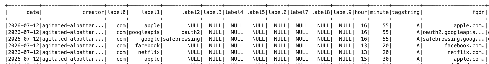
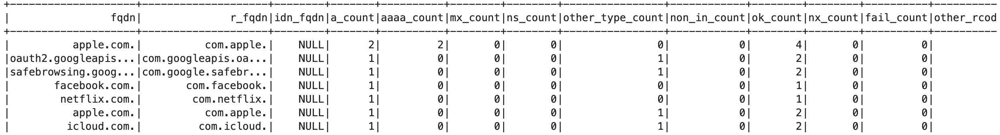
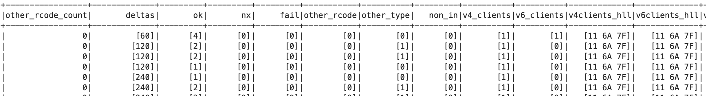
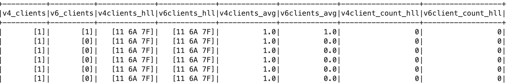

# Grundläggande validering av det aggregerade datasetet i TAPIR Core

## Bakgrund

- GDPR kräver inte att det ska vara absolut omöjligt att kunna identifiera en individ, men möjligheten till identifiering behöver vara extremt osannolik för att datan ska klassas som anonym.
- Anonymiserade uppgifter anses inte längre vara personuppgifter och faller därmed utanför GDPR:s tillämpningsområde.
- Anonymiseringen ska vara irreversibel.
- Det finns tre huvudrisker för avidentifiering: särskiljbarhet, länkbarhet samt inferens

DNS TAPIR anonymiserar data redan på DNS-operatörsnivå. DNS TAPIR behandlar inte några personuppgifter, utan får tillgång till anonymiserade datapaket. I DNS TAPIR-projektet genomförs anonymiseringen genom en kombination sekvensbrytning, anonymiseringstekniker och successiv aggregering.

Uppskattning av unika domän-förfrågningar görs med algoritmen HyperLogLog (HLL) utan att lagra hela datasetet

## Påstående: Explicita IP-adresser existerar inte i TAPIR Core dataset

IP-adresser är en av de primära och indirekta identifierarna i en DNS-förfrågan

**Validering**:

- Exempel på dataschemat inklusive datatyper
- Utdrag dataset Core (1-min aggregat, parquet-format)
- Utdraget som CSV (exkl HLL) för egen analys
- Publikt tillgänglig notebook med kod-exempel för att presentera dataschemat
- Publikt tillgänglig notebook med kod-exempel för att söka efter ip-adress i strängfält IP-adress (IPv4, IPv6)

Nedan är ett exempel på 5-minuters-aggregat. Todo: Ersätt med exempel på 1-minuters-aggregat









En verklig IP-adress skulle lagras som en sträng eller ett 4/16 bytefält (?). De sträng-fält som finns är: creator, fqdn, r_fqdn. Samtliga är domännamn eller resolver-identifierare.

**Schema**

```
root
 |-- date: date (nullable = true)
 |-- creator: string (nullable = true)
 |-- label0: string (nullable = true)
 |-- label1: string (nullable = true)
 |-- label2: string (nullable = true)
 |-- label3: string (nullable = true)
 |-- label4: string (nullable = true)
 |-- label5: string (nullable = true)
 |-- label6: string (nullable = true)
 |-- label7: string (nullable = true)
 |-- label8: string (nullable = true)
 |-- label9: string (nullable = true)
 |-- hour: byte (nullable = true)
 |-- minute: byte (nullable = true)
 |-- tagstring: string (nullable = true)
 |-- fqdn: string (nullable = true)
 |-- r_fqdn: string (nullable = true)
 |-- idn_fqdn: string (nullable = true)
 |-- a_count: long (nullable = true)
 |-- aaaa_count: long (nullable = true)
 |-- mx_count: long (nullable = true)
 |-- ns_count: long (nullable = true)
 |-- other_type_count: long (nullable = true)
 |-- non_in_count: long (nullable = true)
 |-- ok_count: long (nullable = true)
 |-- nx_count: long (nullable = true)
 |-- fail_count: long (nullable = true)
 |-- other_rcode_count: long (nullable = true)
 |-- deltas: array (nullable = true)
 |    |-- element: integer (containsNull = true)
 |-- ok: array (nullable = true)
 |    |-- element: long (containsNull = true)
 |-- nx: array (nullable = true)
 |    |-- element: long (containsNull = true)
 |-- fail: array (nullable = true)
 |    |-- element: long (containsNull = true)
 |-- other_rcode: array (nullable = true)
 |    |-- element: long (containsNull = true)
 |-- other_type: array (nullable = true)
 |    |-- element: long (containsNull = true)
 |-- non_in: array (nullable = true)
 |    |-- element: long (containsNull = true)
 |-- v4_clients: array (nullable = true)
 |    |-- element: long (containsNull = true)
 |-- v6_clients: array (nullable = true)
 |    |-- element: long (containsNull = true)
 |-- v4clients_hll: binary (nullable = true)
 |-- v6clients_hll: binary (nullable = true)
 |-- v4clients_avg: double (nullable = true)
 |-- v6clients_avg: double (nullable = true)
 |-- v4client_count_hll: integer (nullable = true)
 |-- v6client_count_hll: integer (nullable = true)
```

## Påstående: Implicita IP-adresser existerar inte i TAPIR Core dataset

Implementation krypteras IP-adresser innan den hashas
Implementering pågår av kryptering med CryptoPAN före hashning

## Påstående: Exakta tidsstämplar existerar inte i TAPIR Core dataset

Tidsstämplar kan utgöra en identifieringsrisk om de är exakta, eftersom de potentiellt kan matchas mot annan loggdata för att spåra en individs aktivitet. Tidsstämplar i TAPIR Core avrundas eller sammanställs i intervaller.

I TAPIR Core existerar endast 1-minuters-aggregat, dvs inga exakta tidsstämplar.


