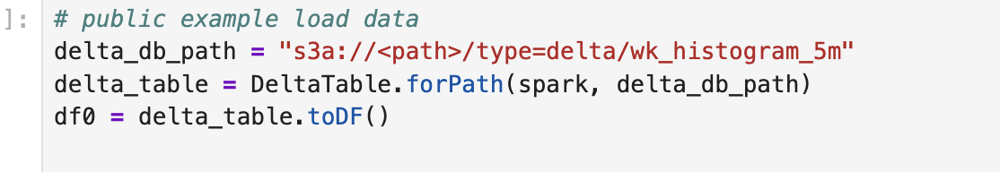
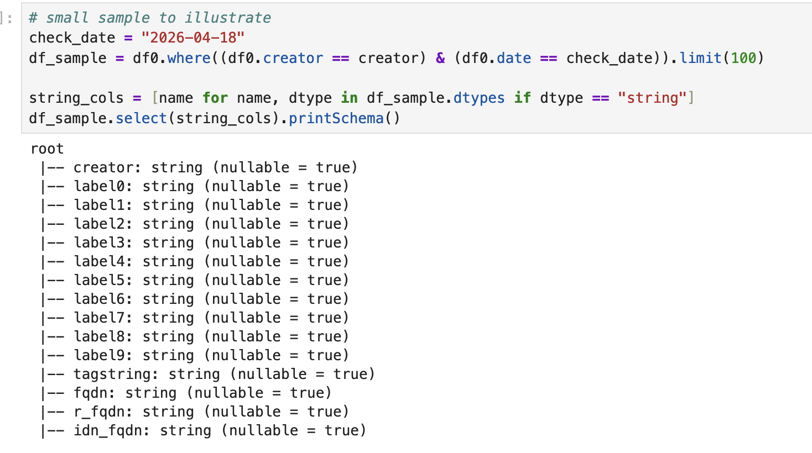

# Validering av personlig integritet och GDPR-efterlevnad i TAPIR Core dataset

---DETTA ÄR ETT UTKAST. WORK IN PROGRESS---

## Bakgrund

- GDPR kräver inte att det ska vara absolut omöjligt att kunna identifiera en individ, men möjligheten till identifiering behöver vara extremt osannolik för att datan ska klassas som anonym. 
- Anonymiserade uppgifter anses inte längre vara personuppgifter och faller därmed utanför GDPR:s tillämpningsområde.
- Anonymiseringen ska vara irreversibel.
- Det finns tre huvudrisker för avidentifiering: särskiljbarhet, länkbarhet samt inferens

(Källla: EU:s dataskyddsförordning)

DNS TAPIR anonymiserar data redan på DNS-operatörsnivå. DNS TAPIR behandlar inte några personuppgifter, utan får tillgång till anonymiserade datapaket. I DNS TAPIR-projektet genomförs anonymiseringen genom en kombination av sekvensbrytning, anonymiseringstekniker och successiv aggregering.

Uppskattning av unika domän-förfrågningar görs med algoritmen HyperLogLog (HLL) utan att lagra hela datasetet

## Regelbundna revisioner, internt
Nedan beskrivs ett antal valideringar och kontroller som genomförs inom open source-projektet. Dessa kan också genomföras av operatören eller andra granskare som operatören utsett.

När projektet har bekräftat att TAPIR Core dataset kan delas till tredje part och framöver även allmänheten kan dessa valideringar även göras av dessa.

Egna förslag för validering, uppmuntras som bidrag till Open Source-repositoryt "privacy-analysis". https://github.com/dnstapir/privacy-analysis

### Rutin
- DataLoad (skapande av 5-minutersaggregat baserat på 1-minutersaggregaten) körs minst 1 gång/vecka (senare automatiserat löpande) Efter DataLoad - exekvera validering av 5-minutershistogram nedan på ett urval av: ...  

## Extern revision
Publicerade notebooks för granskning av TAPIR Core dataset kan exekveras mot publicerade dataurval, eller verklig datakälla under förutsättning att behörigheter finns. Samt för egen installation.


## Påstående: Explicita IP-adresser existerar inte i TAPIR Core dataset

IP-adresser är en av de primära och indirekta identifierarna i en DNS-förfrågan
Inga explicita IP-adresser existerar i TAPIR Core dataset, med undantag för sådana som kan förekomma i domännamn vilket är utanför TAPIRs kontroll och kan inte kopplas till användare

Exempel på sådana domännamn och tjänster som använder dessa är:
4.4.8.8.in-addr.arpa
4.3.3.7.0.7.3.0.e.2.a.8.0.0.0.0.0.0.0.0.3.a.5.8.8.b.d.0.1.0.0.2.ip6.arpa

Andra aktörer kan använda/koda IP-adress till domännamnet/frågan vilket är utanför DNS TAPIR kontroll.  Tillgängliggörandet av DNS-frågor för analys innebär att bland annat kunna hitta dessa typer av domännamn för rapportering av privacy-läckage. 

-- todo: beskriv  problemet och ansvarsfriheten tydligare, ge fler exempel? -- 

Exempel: spamhouse-tjänsten, kodar ip-tjänster
Ett annat exempel är att telefonnummer kan vara kodade i domännamnet, vilket likaså är utanför DNS TAPIRs databehandling.
Exempel: enum (telefonnummer), gotanet

någon annan kan ta ip-adressen + koda med byte64 - fråga efter....

**Validering**:
- Dataschemat inklusive datatyper
- Utdrag dataset Core 5-min-aggregat 
- Utdrag dataset Core 1-min aggregat,[Samples av parquet-filer (1-minutersaggregat)](samples/).
- Utdraget som CSV (exkl HLL) för egen analys, vid förfrågan
- Publikt tillgänglig notebook med kod-exempel för att presentera dataschemat.  [samples/PrivacyCheck.ipynb](samples/PrivacyCheck.ipynb)
- Publikt tillgänglig notebook med kod-exempel för att söka efter ip-adress (IPv4, IPv6) [samples/PrivacyCheck.ipynb](samples/PrivacyCheck.ipynb)
- Notebooks kan exekveras mot verklig datakälla (under förutsättning att behörigheter finns)

### Schema aggregates

I framtiden, när det för privata aktörer finns en konfiguration för att skicka med IP-adresser, behöver också synas i schema-exempel vilken konfig Edge har. 

```text
root
 |-- date: date (nullable = true)
 |-- creator: string (nullable = true)
 |-- label0: string (nullable = true)
 |-- label1: string (nullable = true)
 |-- label2: string (nullable = true)
 |-- label3: string (nullable = true)
 |-- label4: string (nullable = true)
 |-- label5: string (nullable = true)
 |-- label6: string (nullable = true)
 |-- label7: string (nullable = true)
 |-- label8: string (nullable = true)
 |-- label9: string (nullable = true)
 |-- hour: byte (nullable = true)
 |-- minute: byte (nullable = true)
 |-- tagstring: string (nullable = true)
 |-- fqdn: string (nullable = true)
 |-- r_fqdn: string (nullable = true)
 |-- idn_fqdn: string (nullable = true)
 |-- a_count: long (nullable = true)
 |-- aaaa_count: long (nullable = true)
 |-- mx_count: long (nullable = true)
 |-- ns_count: long (nullable = true)
 |-- other_type_count: long (nullable = true)
 |-- non_in_count: long (nullable = true)
 |-- ok_count: long (nullable = true)
 |-- nx_count: long (nullable = true)
 |-- fail_count: long (nullable = true)
 |-- other_rcode_count: long (nullable = true)
 |-- deltas: array (nullable = true)
 |    |-- element: integer (containsNull = true)
 |-- ok: array (nullable = true)
 |    |-- element: long (containsNull = true)
 |-- nx: array (nullable = true)
 |    |-- element: long (containsNull = true)
 |-- fail: array (nullable = true)
 |    |-- element: long (containsNull = true)
 |-- other_rcode: array (nullable = true)
 |    |-- element: long (containsNull = true)
 |-- other_type: array (nullable = true)
 |    |-- element: long (containsNull = true)
 |-- non_in: array (nullable = true)
 |    |-- element: long (containsNull = true)
 |-- v4_clients: array (nullable = true)
 |    |-- element: long (containsNull = true)
 |-- v6_clients: array (nullable = true)
 |    |-- element: long (containsNull = true)
 |-- v4clients_hll: binary (nullable = true)
 |-- v6clients_hll: binary (nullable = true)
 |-- v4clients_avg: double (nullable = true)
 |-- v6clients_avg: double (nullable = true)
 |-- v4client_count_hll: integer (nullable = true)
 |-- v6client_count_hll: integer (nullable = true)
```

Utdrag 5-minuters-aggregat.


En verklig IP-adress lagras som en sträng eller ett binärfält. Det enda binärfält som existerar i datasetet är HLL-sketcher (se ovan). HLL-sketcher kan per definition inte innehålla explicita IP-adresser. Referens:  https://datasketches.apache.org/docs/HLL/HllSketches.html

### Verifiera att inga explicita IP-adresser finns i TAPIR Core

ipv4-mönster utökas vid behov.
utöka med oktalprefix ipv4 0.14






ipv6_pattern utökas vid behov,  alla ipv6-format täcks inte i detta exempel.
(todo: konvertera först till upper case för enklare pattern)
```python
ipv6_pattern = (
    r"([0-9a-fA-F]{1,4}:){7}[0-9a-fA-F]{1,4}|"
    r"([0-9a-fA-F]{1,4}:){1,7}:|"
    r"([0-9a-fA-F]{1,4}:){1,6}:[0-9a-fA-F]{1,4}|"
    r"([0-9a-fA-F]{1,4}:){1,5}(:[0-9a-fA-F]{1,4}){1,2}|"
    r"([0-9a-fA-F]{1,4}:){1,4}(:[0-9a-fA-F]{1,4}){1,3}|"
    r"([0-9a-fA-F]{1,4}:){1,3}(:[0-9a-fA-F]{1,4}){1,4}|"
    r"([0-9a-fA-F]{1,4}:){1,2}(:[0-9a-fA-F]{1,4}){1,5}|"
    r"[0-9a-fA-F]{1,4}:(:[0-9a-fA-F]{1,4}){1,6}|"
    r":(:[0-9a-fA-F]{1,4}){1,7}|"
    r"::"
)

ipv6_nibble_pattern = r"[0-9a-fA-F](\.[0-9a-fA-F]){31}"
```


## Påstående: Implicita IP-adresser existerar inte i TAPIR Core dataset

Fråga: Är det här ett GDPR-problem eller inte? 

För att inga implicita IP-adresser ska gå att identifiera i HLL-sketch så implementeras kryptering av IP-adress med t.ex AES före beräkning av HLL-sketch. Då går inte att reversera till IP-adresser.

Med denna kryptering så uppmanas att använda samma "hemlighet", seed, på alla Edge hos en operatör för att kunna merga HLL-sketcher mellan dessa. Dvs kunna beräkna antal klienter utan dubbletter.

Problemet utan kryptering: 
Utan kryptering lämnas spår av IP-adresser i HLL-sketchen som  för vissa IP-adresser kan vara igenkännbara. Vissa IP-adresser kan hashas till "många 0:or i mitten". Vilka IP-adresser som får detta kan räknas ut på förhand, givet att man känner till hur HLL:en är uppbyggd.  Med rainbow table går det då att återskapa IP-adress. För att göra detta behöver kunskap finnas om konfigurationsparametrar till HLL-strukturen, det går även att göra kvalificerade gissningar. 

Simulering och beräkningar av problemet:
[/becoming-uniquely-identifiable-in-a-hyperloglog-sketch](/becoming-uniquely-identifiable-in-a-hyperloglog-sketch)x

**Validering**
- Validera att IP-adresser krypteras innan HLL-sketch beräknas. Görs genom källkodsgranskning i EDM. Repo: under arbete

## Påstående:  Sekund-tidsstämplar existerar inte i TAPIR Core dataset

-- REVIEW --

Tidsstämplar kan utgöra en identifieringsrisk om de är exakta på sekundnivå, eftersom de potentiellt kan matchas mot annan logg-data, t.ex webblogg, för att spåra en individs aktivitet.

Referens?

Tidsstämplar i TAPIR Core avrundas eller sammanställs i intervaller om 1 minut. Den enda sekund-tidsstämpeln som existerar är i metadatat Core, vilket visar när minut-intervallet startar.

Det gör det mycket svårt att matcha med exempelvis en webblogg hos en större operatör. Större = minst n klienter/minut. Dessutom innehåller TAPIR Core dataset endast domänförfrågningar på domäner som ingår i Well Known-listan, se nedan.

**Vidareutveckling för mindre operatörer**
En lösning som planeras för små operatörer: skapa en Aggregations-Edge

**Anteckningar, frågor**
Sekundtidsstämplar ... RFC... Matcha tidsstämplar
Vilka kända attacker finns? Vilken upplösning krävs?
RFC 9076 [https://www.rfc-editor.org/info/rfc9076/](https://www.rfc-editor.org/info/rfc9076/)

### Validering

- Exempel på dataschemat inklusive datatyper (se ovan)
- Utdrag dataset Core (1-min aggregat, parquet-format) [samples](samples/)
- Utdraget av 1-min-aggregat som CSV (exkl HLL) för egen analys, vid förfrågan
- Publikt tillgänglig notebook med kod-exempel för att presentera dataschemat.  [samples/PrivacyCheck.ipynb](samples/PrivacyCheck.ipynb)
- Publikt tillgänglig notebook med kod-exempel för att söka efter ip-adress (IPv4, IPv6) [samples/PrivacyCheck.ipynb](samples/PrivacyCheck.ipynb)

**Utdrag 1-min aggregat**

Todo: Distinct. Se flera minuter + creator

Tidsstämpeln som syns i 1-minutersaggregat är när aggregatet publicerades till TAPIR Core. Samma minut - samma Edge.  (förslag - EDM forcerar tidsstämpeln till YYYY-MM-DD-HH-MM för enhetlighet, vill vi det?)

Tidsstämplar skickas binärkodade enligt parquet-tidsstämpelformat.


- Notebook finns tillgänlig publikt med sample parquet-fil  [samples/ViewParquet.ipynb](samples/ViewParquet.ipynb)
- Utökas med fler verifieringar vid behov.


## Påstående: TAPIR Core dataset innehåller endast domäner från Well Known-listan

1-minutersaggregaten innehåller endast frågor på domäner i Well Known-listan. Det innebär att upplösningen på datasetet i TAPIR Core är låg. Alla frågor finns inte i datasetet. 

Antal domäner i den i installationspaketet föreslagna Well Known-listan är: minst x
Antal nya domäner (dvs ej i Well Known och ej i 1-minutersaggregat) som observeras under en minut är: y för <operatör>

En stor mängd domänförfrågningar finns alltså inte i 1-minutersaggregaten.

**Referenser, omvärld**
I analyser av beteendeavtryck, "fingerprints", på DNS-frågor då individer har identifierats, har de dataset som används en betydligt högre tidsupplösning än DNS TAPIR. Ofta på sekundnivå.
Då har också alla dns-förfrågningar, domänuppslag ingått i datasetet som analyserats, till skillnad från den lägre upplösningen i TAPIR Core, som enbart innehåller Well Known-domäner. 

Exempel: A_User_DNS_Fingerprint_Dataset.pdf, Zápotockýa et al

Det är Well Known-filen som styr vilka domännamn som är tillgängliga i aggregaten för analys.
För att bekräfta att det inte förekommer unika domännamn i Well Known gör projektet regelbundna kontroller av vilka domäner som finns i Well Known-filen. 
### Validering

- Jämför antal domäner i Well Known med antal nya observerade domäner? 
- Undersök att aktuell Well Known-fil används: 
[https://dnstapir.github.io/techdocs/postinstall.html#maintaining-the-well-known-domains-filter](https://dnstapir.github.io/techdocs/postinstall.html#maintaining-the-well-known-domains-filter)
- Publicera Well Known-filen så att operatörer och allmänheten kan slå upp ovanliga eller integritetskänsliga domännamn.  Publicera dokumentation och kod för att undersöka Well Known efter sin adress.

#### Anteckningar

- Verifiera att alla kända contentnätverk (CDN) är inlagda på rätt sätt i Well Known. Kanske kan TAPIR publicera listan på kända CDNS och annonsnätverk och logiken för hur de hanteras med wildcard (?) 

## Påstående: Ovanliga domän-förfrågningar existerar en gång i TAPIR Core

Hur kopplas detta till privacy-problemet?

 Tidigare osedda domäner,  genererar en observation av ny domän i TAPIR Core. Dessa skulle potentiellt kunna användas för att följa en individs unika beteende (?)....

En unik domän är en domän som bara får frågor från en eller ett fåtal användare. Det kan bero på att domänen har få besökare, t.ex en personlig webbsida, eller att domänen används för att spåra individer genom unika sub-domäner. Exempelvis annonstjänster kan använda sig av det.

Att unika domäner blir en enda observation av ny domän är inte ett problem eftersom ingen information följer med i observationsdatat som kan användas för identifiering.

Exempel: 87rxrdobfl4goostvxilqmxnm36bmqou.ad.example.com
Exempel: nissetuta.familjenswebsida.exempel.se
Exempel:  domäner som inte används längre

Event för ny domän lagras separat från aggregaten, alltså inte i 1-minuters-aggregaten. Event lagras en gång per Edge som sett frågan en gång.
- domännamn
- creator (TAPIR Edge)
- Tidsstämpel när eventet publicerades 

### Validering

- Koden för hur EDM publicerar events finns här: [github.com/dnstapir/edm...](github.com/dnstapir/edm...)  
- Undersök dataset efter domäner med fåtal frågor och besluta om den ska uteslutas ur Well Known och endast hanteras som event. Publicera notebook för att hitta dessa domäner.
- Senare: Publicera ett urval av 5-minuters-aggregat publikt, med regelbundenhet
- Eventuellt: Visa sample från NATS key-value store.
- Eventuellt: Kod-exempel för att leta efter ett eller många kända unika domännamn i TAPIR Core Dataset

## Påstående: Unikt identifierbara dns-fråge-mönster i TAPIR Core aggregat är extremt osannolikt

Se: [privacyvalidering-patterns.md](privacyvalidering-patterns.md)