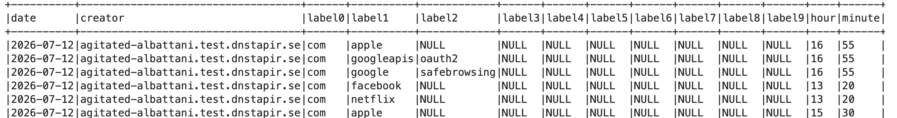
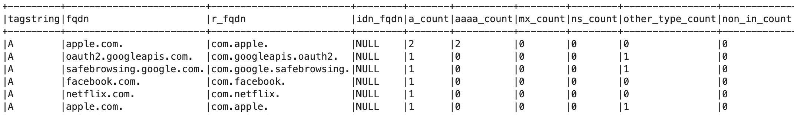
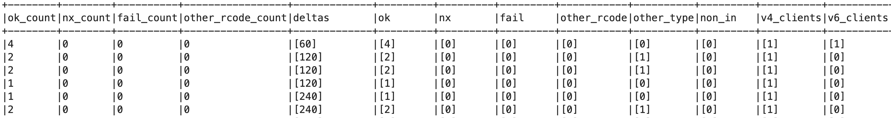
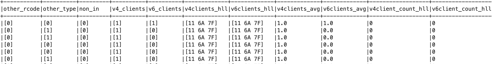
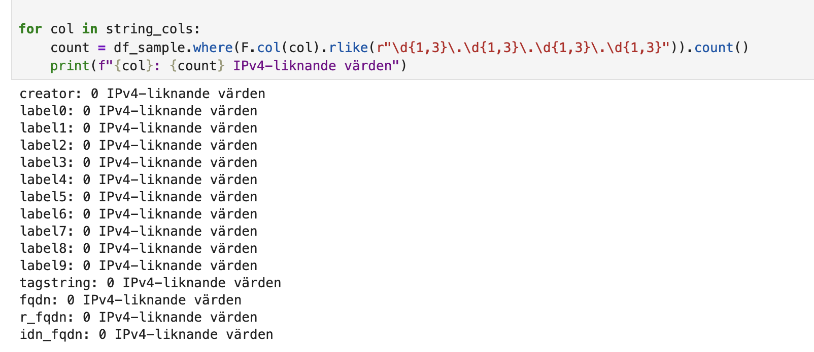
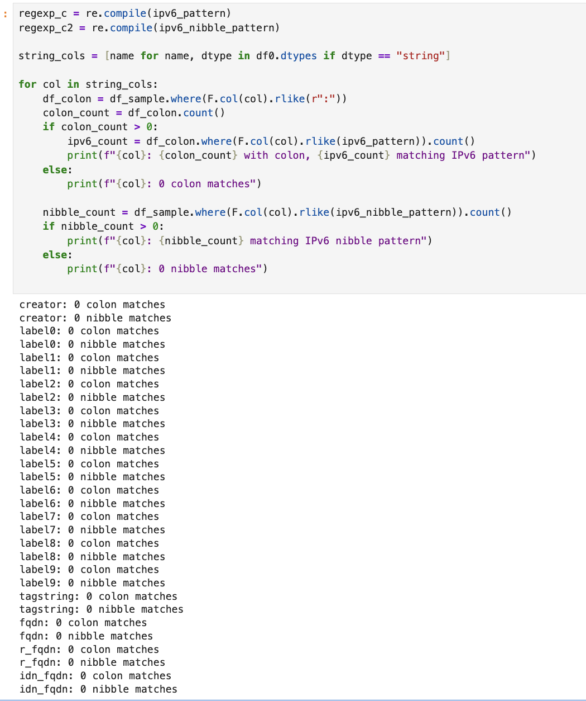
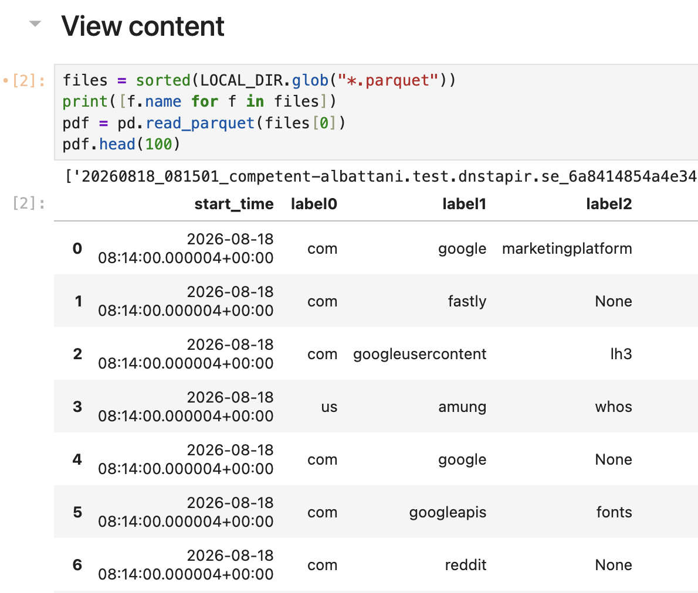
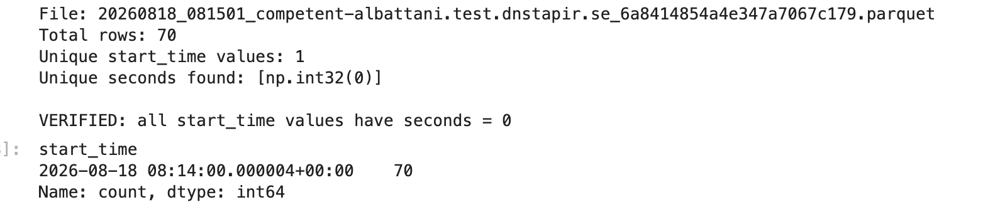

# Grundläggande validering av det aggregerade datasetet i TAPIR Core

---DETTA ÄR ETT UTKAST. WORK IN PROGRESS---

## Bakgrund

- GDPR kräver inte att det ska vara absolut omöjligt att kunna identifiera en individ, men möjligheten till identifiering behöver vara extremt osannolik för att datan ska klassas som anonym.
- Anonymiserade uppgifter anses inte längre vara personuppgifter och faller därmed utanför GDPR:s tillämpningsområde.
- Anonymiseringen ska vara irreversibel.
- Det finns tre huvudrisker för avidentifiering: särskiljbarhet, länkbarhet samt inferens

DNS TAPIR anonymiserar data redan på DNS-operatörsnivå. DNS TAPIR behandlar inte några personuppgifter, utan får tillgång till anonymiserade datapaket. I DNS TAPIR-projektet genomförs anonymiseringen genom en kombination av sekvensbrytning, anonymiseringstekniker och successiv aggregering.

Uppskattning av unika domän-förfrågningar görs med algoritmen HyperLogLog (HLL) utan att lagra hela datasetet

## Påstående: Explicita IP-adresser existerar inte i TAPIR Core dataset

IP-adresser är en av de primära och indirekta identifierarna i en DNS-förfrågan
Inga explicita IP-adresser existerar i TAPIR Core dataset, med undantag för sådana som kan förekomma i domännamn vilket är utanför TAPIRs kontroll.

Exempel på sådana domännamn och tjänster som använder dessa är:
4.4.8.8.in-addr.arpa
4.3.3.7.0.7.3.0.e.2.a.8.0.0.0.0.0.0.0.0.3.a.5.8.8.b.d.0.1.0.0.2.ip6.arpa

**Validering**:

- Exempel på dataschemat inklusive datatyper
- Utdrag dataset Core (5-min aggregat)
- Utdraget som CSV (exkl HLL) för egen analys, vid förfrågan
- Publikt tillgänglig notebook med kod-exempel för att presentera dataschemat.  [samples/PrivacyCheck.ipynb](samples/PrivacyCheck.ipynb)
- Publikt tillgänglig notebook med kod-exempel för att söka efter ip-adress (IPv4, IPv6) [samples/PrivacyCheck.ipynb](samples/PrivacyCheck.ipynb)
- Notebooks kan exekveras mot verklig datakälla (under förutsättning att behörigheter finns), eller mot ett eller flera samples av parquet-filer (1-minutersaggregat). Sample:  [sample](samples/20260818_081501_competent-albattani.test.dnstapir.se_6a8414854a4e347a7067c179.parquet)

### Schema aggregates

```text
root
 |-- date: date (nullable = true)
 |-- creator: string (nullable = true)
 |-- label0: string (nullable = true)
 |-- label1: string (nullable = true)
 |-- label2: string (nullable = true)
 |-- label3: string (nullable = true)
 |-- label4: string (nullable = true)
 |-- label5: string (nullable = true)
 |-- label6: string (nullable = true)
 |-- label7: string (nullable = true)
 |-- label8: string (nullable = true)
 |-- label9: string (nullable = true)
 |-- hour: byte (nullable = true)
 |-- minute: byte (nullable = true)
 |-- tagstring: string (nullable = true)
 |-- fqdn: string (nullable = true)
 |-- r_fqdn: string (nullable = true)
 |-- idn_fqdn: string (nullable = true)
 |-- a_count: long (nullable = true)
 |-- aaaa_count: long (nullable = true)
 |-- mx_count: long (nullable = true)
 |-- ns_count: long (nullable = true)
 |-- other_type_count: long (nullable = true)
 |-- non_in_count: long (nullable = true)
 |-- ok_count: long (nullable = true)
 |-- nx_count: long (nullable = true)
 |-- fail_count: long (nullable = true)
 |-- other_rcode_count: long (nullable = true)
 |-- deltas: array (nullable = true)
 |    |-- element: integer (containsNull = true)
 |-- ok: array (nullable = true)
 |    |-- element: long (containsNull = true)
 |-- nx: array (nullable = true)
 |    |-- element: long (containsNull = true)
 |-- fail: array (nullable = true)
 |    |-- element: long (containsNull = true)
 |-- other_rcode: array (nullable = true)
 |    |-- element: long (containsNull = true)
 |-- other_type: array (nullable = true)
 |    |-- element: long (containsNull = true)
 |-- non_in: array (nullable = true)
 |    |-- element: long (containsNull = true)
 |-- v4_clients: array (nullable = true)
 |    |-- element: long (containsNull = true)
 |-- v6_clients: array (nullable = true)
 |    |-- element: long (containsNull = true)
 |-- v4clients_hll: binary (nullable = true)
 |-- v6clients_hll: binary (nullable = true)
 |-- v4clients_avg: double (nullable = true)
 |-- v6clients_avg: double (nullable = true)
 |-- v4client_count_hll: integer (nullable = true)
 |-- v6client_count_hll: integer (nullable = true)
```

Exempel på 5-minuters-aggregat.









En verklig IP-adress lagras som en sträng eller ett BINARY(4) för IPv4, BINARY(16) för IPv6 (?). 32 bytefält (?).
Fråga: Behöver check göras i HLL-fältet?

### Verifiering av att inga explicita IP-adresser finns i TAPIR Core

Fråga: Hur stort sample behöver det vara?



ipv6_pattern utökas vid behov, exakt alla ipv6-format täcks inte i detta exempel.

```python
ipv6_pattern = (
    r"([0-9a-fA-F]{1,4}:){7}[0-9a-fA-F]{1,4}|"
    r"([0-9a-fA-F]{1,4}:){1,7}:|"
    r"([0-9a-fA-F]{1,4}:){1,6}:[0-9a-fA-F]{1,4}|"
    r"([0-9a-fA-F]{1,4}:){1,5}(:[0-9a-fA-F]{1,4}){1,2}|"
    r"([0-9a-fA-F]{1,4}:){1,4}(:[0-9a-fA-F]{1,4}){1,3}|"
    r"([0-9a-fA-F]{1,4}:){1,3}(:[0-9a-fA-F]{1,4}){1,4}|"
    r"([0-9a-fA-F]{1,4}:){1,2}(:[0-9a-fA-F]{1,4}){1,5}|"
    r"[0-9a-fA-F]{1,4}:(:[0-9a-fA-F]{1,4}){1,6}|"
    r":(:[0-9a-fA-F]{1,4}){1,7}|"
    r"::"
)

ipv6_nibble_pattern = r"[0-9a-fA-F](\.[0-9a-fA-F]){31}"
```



## Påstående: Implicita IP-adresser existerar inte i TAPIR Core dataset

Implementering pågår av kryptering med CryptoPAN före hashning
IP-adresser krypteras innan de hashas.

**Validering**
...

## Påstående: Exakta tidsstämplar existerar inte i TAPIR Core dataset

Tidsstämplar kan utgöra en identifieringsrisk om de är exakta, eftersom de potentiellt kan matchas mot annan loggdata för att spåra en individs aktivitet. Tidsstämplar i TAPIR Core avrundas eller sammanställs i intervaller.

I TAPIR Core existerar endast 1-minuters-aggregat, dvs inga exakta tidsstämplar.

För att en exakt tidstämpel ska vara relevant för att följa sekvenser av frågor behövs: datum, timme, minut, sekund (lägg till: källa?)

Den enda sekund-tidsstämpeln som existerar är i metadatat, när aggregatet togs emot av TAPIR Core, vilket visar när minut-intervallet startar.

### Validering

- Exempel på dataschemat inklusive datatyper (se ovan)
- Utdrag dataset Core (1-min aggregat, parquet-format) 
- Utdraget av 1-min-aggregat som CSV (exkl HLL) för egen analys, vid förfrågan
- Publikt tillgänglig notebook med kod-exempel för att presentera dataschemat
- Förslag: Öppen notebook. Ta fram en sample-parquet, använd ett enkelt verktyg, exempelvis Hyparquet för att visa schemat och datasample via Github Pages.

**Utdrag 1-min aggregat**
Notebook finns tillgänlig publikt med sample parquet-fil [samples/ViewParquet.ipynb](samples/ViewParquet.ipynb)
Fler samples fås vid förfrågan
Tillgång till datalagret fås vid förfrågan och under förutsättning att rätt behörigheter finns



### Verifiera att alla poster endast har 0 som sekundvärde

- Notebook finns tillgänlig publikt med sample parquet-fil  [samples/ViewParquet.ipynb](samples/ViewParquet.ipynb)
- Utökas med fler verifieringar vid behov.



## Påstående: Unikt identifierbara domäner, förfrågningar, existerar endast som events som publiceras som observation till TAPIR Core

Unika domäner kan existera som events, som en observation av ny domän. Dessa events lagras i NATS/key-valuestore utan annan meta-data än tidsstämpel när eventet skickades (är den fördröjd?)...  EDM skickar events men ej exakt, fördröjd.

to be continued.

Exempel, case:  minunikaidentifierare.example.com. lagras i key-value-store med tidsstämpel när eventet skickades.

Exempel: nissatuta.com - sparas en gång att den har setts av en ny creator. vilken creator, tidsstämpel när eventet skickades

### Validering

- Koden för hur EDM publicerar events finns här: [github.com/dnstapir/edm...](github.com/dnstapir/edm...)  
- Eventuellt: Visa sample från NATS key-value store.

## Påstående: Unikt identifierbara dns-fråge-mönster i TAPIR Core aggregat är extremt osannolikt

---- WORK IN PROGRESS ----

Går det att hitta en frågeställare, en avsändaridentitet, som skulle kunna vara t.ex ett hushåll i HLL-sketchen? Och utifrån den avsändaridentiteten följa ett mönster t.ex:  internetstiftelsen.se -> gnestafågelskådare -> gnestalillaförskola -> skobesgnesta?

Förutsätter att de domänerna finns i wellknown +  otur med den hashade adressen, HLL-sketchen

För att en domän ska finnas i aggregat behöver den finnas i well known-listan som är baserad på Open Page Rank och liknande publika källor.  Well-known-filen finns här: [github.com/dnstapir/...](github.com/dnstapir/...)  Edge-operatören kan ersätta med valfri.

Well Known : Micke publicerar scripten som genererar well known.

Även om en unikt identiferbar domän finns, går det inte att identifera individ. För att det ska hända så behöver en kombination av unikt utseende på hll-sketchen plus unikt identiferbar domän existera. 1 person med unikt utseende på hll-sketchen frågar efter samma unika domän regelbundet..

**Förändringar som planeras, säkerhetsåtgärd så att det inte ska kunna ske:**
Dela upp Well Known Domains i:

- Well well known.  (google.com, apple.com osv)
- Less well known. Annan metodik för HLL-sketchen, går då inte jämföra kardinalitet mellan domäner. HLL-sketchen genereras utifrån IP-adress+domänen

Förslag på ytterligare säkerhetsåtgärder om det skulle anses nödvändigt: 

- Endast domäner med x antal förfrågningar kan existera i wellknown.

Varför är det viktigt?

Hantering av longitudinell analys...  ska inte kunna leta upp intressant i aggregaten, kommer inte kunna lägga ihop 1 timme och 5 min.

### Validera

- Genomför en membership inference attack (kostar)
- M visar en PoC på en membership inference attack, 9/9, spela in
- Beräkna sannolikheten att  identifiera en enskild “avsändaridentitet” i HLL-sketcher  (Leon dokument … )

- Hur stor får sannolikheten vara för ett unikt fingeravtryck? Räcker det med att det är ett ovanligt fingeravtryck?
- Är beräkningarna korrekta, återspeglar det verkligheten?
- Beräkna utifrån hur många kunder en ISP kan ha i sitt nät? x procent kan vara unika … i tal. Är det acceptabel nivå?
- Går det att se ett mönster från den enskilda entiteten
- Beskriv: Hur göra för att hitta en unikt identifierbar frågeställare i HLL-sketch. Ta fram ett frågemönster för denna avsändar-identitet (= Membership inference attack?).
- Är det tillräckligt ovanligt för att anses som osannolikt?