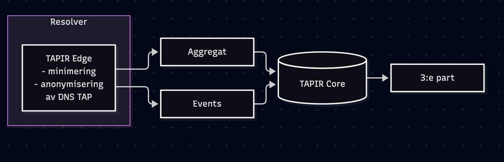
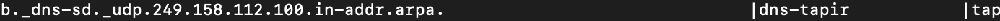

# Validering av personlig integritet och GDPR-efterlevnad i TAPIR Core dataset

---DETTA ÄR ETT UTKAST. WORK IN PROGRESS---

## Bakgrund

- GDPR kräver inte att det ska vara absolut omöjligt att kunna identifiera en individ, men möjligheten till identifiering behöver vara extremt osannolik för att datan ska klassas som anonym. 
- Anonymiserade uppgifter anses inte längre vara personuppgifter och faller därmed utanför GDPR:s tillämpningsområde.
- Anonymiseringen ska vara irreversibel.
- Det finns tre huvudrisker för avidentifiering: särskiljbarhet, länkbarhet samt inferens
- Personuppgifter inkluderar allt som kan identifiera en enskild individ. Utöver namn och ID-uppgifter inkluderas även kvasi-identifierare såsom IP-adresser, transaktionsmönster och enhetsavtryck. [GDPR Artikel 4](https://gdpr-info.eu/art-4-gdpr/)
(Källla: EU:s dataskyddsförordning)

DNS TAPIR anonymiserar data redan på DNS-operatörsnivå. DNS TAPIR behandlar inte några personuppgifter, utan får tillgång till anonymiserade datapaket. I DNS TAPIR-projektet genomförs anonymiseringen genom en kombination av sekvensbrytning, anonymiseringstekniker och successiv aggregering.

## Risker för personlig integritet och åtgärder
När ett dataset med DNS-frågor delas finns en risk att en individ kan identifieras genom frågesekvenser. Dataarkitekturen i DNS TAPIR är framtagen för att minimera dessa risker till extrem osannolikhet.  

Några åtgärder:

- Uppskattning av antal unika domän-förfrågningar görs med anonymiseringsalgoritmen HyperLogLog (HLL) utan att lagra IP-adresser
- Kryptering av IP-adresser innan beräkning med HLL
- Potentiellt känsliga domänförfrågningar exkluderas från central analys (TAPIR Core)
- Exkludera sekund-tidsstämplar på domänförfrågningar, endast 1-min aggregat är tillgängliga för analys

Dokumentation av dataarkitektur och dataöverföring från TAPIR Edge till TAPIR Core finns här: [Informationshantering](https://www.dnstapir.se/docs/tapir-info-mgmt-sv/)

## Mål: TAPIR Core dataset är validerat att inte inkludera personlig data enligt GDPR

### Omfattning
 Utvärderingen täcker dataflödet från TAPIR Edge till TAPIR Core, de minimerade och anonymiserade dataset som lämnar operatörens resolver. Detta är aggregat i form av parquet-filer, samt events i form av en key-value-databas.

### Revisionsmetod
GDPR-efterlevnad uppnås inte vid enskilt tillfälle, det underhålls löpande. Personlig integritet i dataset bör monitoreras kontinuerligt.

Dessa aktiviteter kan genomföras inom TAPIR projektorganisation, av operatörens egna granskare eller av extern granskare med behörigheter.

- Sök efter PII (Personliga identifierare), i detta fall IP-adresser.
- Testa för åter-identifiering. Exempelvis: Är HLL-sketch (räknare av uppskattat antal klienter) irreversibel?
- Testa för att hitta sekund-tidsstämplar och ovanliga domänförfrågningar som potentiellt skulle kunna användas för att identifera mönster
- Eventuellt, kanske ej nödvändigt för GDPR-efterlevnad: Testa för att hitta frågemönster tillhörande en eller ett fåtal unika frågeställare, samt korrelera sådana sekvenser med annan information för att identifiera individ. 
- Automatisera, eller semi-automatisera dessa aktiviteter
- Logga mätvärden och resultat av testen.

####  Sök efter PII (personliga identifierare)

- Sök efter IP-adress i aggregat

####  Testa för återidentifiering

- Utifrån en HLL-sketch samt ett känt subnät, försök återidentifiera en IP-adress. Alternativt beräkna sannolikheten.

#### Sök efter sekundtids-stämpel i domänförfrågningar

Genom att inte inkludera finkorninga tidsangivelser minskar möjligheten att identifiera avtryck från individ. TAPIR Core aggregat innehåller endast minutangivelser.

- Sök efter sekundtidsstämpel i aggregat

#### Sök efter ovanliga domännamn

Genom att endast inkludera välkända domäner i Core dataset så minskar risken för att kunna indentifiera avtryck från individ. Forskning som analyserar fingerprints i DNS, använder
framförallt hela frågesekvenser för identifiering (källa..). TAPIR Core exkluderar ovanliga domännamn.

- Verifiera att Well Known-domäner som används i Core dataset inte innehåller ovanliga domännamn genom sökning.
- Ovanliga domännamn existerar bara som en observation, vid ett tillfälle per Edge.

Exempel på observation av eventet ny domän:

#### Events?

#### Testa för att hitta frågemönster

- ....

#### Automatisering av valideringstest

- När DataLoad exekveras (sammanställning av 1-minutersaggregat till 5-minutersaggregat), exekvera grundläggande test av innehållet i aggregaten, på ett urval. Grundläggande test: Sök efter IP-adress och sekundstämplar. 

#### Manuell validering

- Undersök Well Known-fil
- Membership Inference Attack. Önskvärt, kostsamt och tidskrävande. Sannolikt inte nödvändigt för GDPR-efterlevnad utan enbart för DNS TAPIR utökade integritetsmål.

